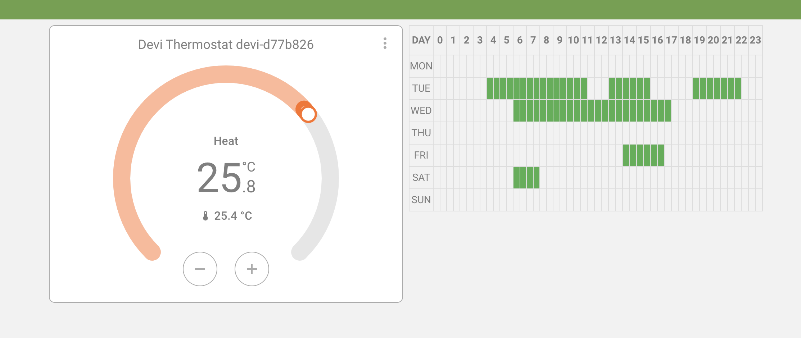

# Weekly Schedule Card



The Weekly Schedule Card is a custom card for Home Assistant that allows you to display and manage a weekly schedule for various devices. It supports different input and output formats, but does not contain a schedule executor service (like cron). To understand it better or integrate, enable `devMode`.

## Options

### Option 1: Static Schedule

```yaml
type: custom:weekly-schedule-card
devMode: false
encodingSchema: Devi
entity: >-
  {"MON":[],"TUE":["84cB","8D90","93d6"],"WED":["86d1"],"THU":[],"FRI":["8E91"],"SAT":[],"SUN":[]}
```

- **type**: Defines the card type. For this card, it should be `custom:weekly-schedule-card`.
- **devMode**: Enables developer mode. Set to `false` for this option.
- **encodingSchema**: Specifies the encoding schema used for the schedule. In this example, it is set to `Devi`.
- **entity**: A JSON string representing the schedule for each day of the week. Each day can have multiple time slots encoded in the `Devi` format.

### Option 2: Dynamic Schedule

```yaml
type: custom:weekly-schedule-card
devMode: true
encodingSchema: Devi
commandTopic: bluetti/command/AC70-2403000094022/test_json
entity: sensor.ac70_test_json
```

- **type**: Defines the card type. For this card, it should be `custom:weekly-schedule-card`.
- **devMode**: Enables developer mode. Set to `true` for this option.
- **encodingSchema**: Specifies the encoding schema used for the schedule. In this example, it is set to `Devi`.
- **commandTopic**: MQTT topic to which the schedule will be published.
- **entity**: Entity ID of the sensor that contains the schedule in JSON format.

## Installation Instructions

### Manual Installation

Add the following to your `configuration.yaml` file:

```yaml
lovelace:
  mode: yaml
  resources:
    - url: /hacsfiles/weekly-schedule-card/weekly-schedule-card.js
      type: module
```

### HACS Installation

1. Install the card using HACS (Home Assistant Community Store).
2. Add the resource URL to your Lovelace configuration as shown above.

## Example Configuration

```yaml
type: custom:weekly-schedule-card
devMode: true
encodingSchema: Devi
commandTopic: bluetti/command/AC70-2403000094022/test_json
entity: sensor.ac70_test_json
```

## Usage

After adding the configuration to your Lovelace dashboard, you can interact with the weekly schedule by clicking on the time slots to select or deselect them. The selected slots will be highlighted, and you can update the schedule by clicking the "Update" button.

### Developer Mode

- **devMode**: When set to `true`, enables additional options for testing and debugging.
- **encodingSchema**: Allows you to choose between different encoding schemas (`JSON`, `Devi`, `Bitmask`, `All`) for the schedule data.
- **scheduleOutput**: Displays the current schedule in the selected encoding schema.
- **applyScheduleButton**: Applies the current schedule to the table.

### Encoding Schemas

- **JSON**: Standard JSON format for schedule representation.
- **Devi**: Custom encoding schema for specific use cases.
- **Bitmask**: Binary representation of the schedule.
- **All**: Displays the schedule in all available schemas.

### Schedule Management

- **Add Time Slots**: Click on the desired time slots to select them.
- **Remove Time Slots**: Click on the selected time slots to deselect them.
- **Reset Day Schedule**: Click on the day label to reset the schedule for that day.
- **Update Schedule**: Click the "Update" button to save changes to the schedule.

## Troubleshooting

- Ensure the card is added as a resource in your Lovelace configuration.
- Verify the `entity` and `commandTopic` configurations.
- Check the browser console for any error messages if the card does not render correctly.

By following the instructions above, you can easily integrate and use the Weekly Schedule Card in your Home Assistant setup.
